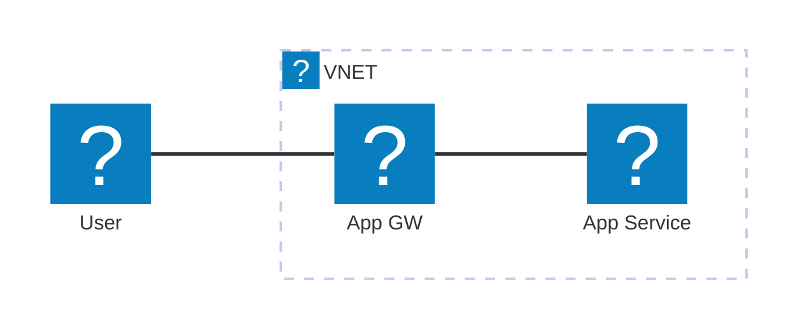

# Environnement Cloud Azure

## Comment héberger du legacy ?

  

```mermaid
architecture-beta
    group vnet(azure:virtual-networks)[VNET]
    service user(carbon:user)[User]

    service lb(azure:application-gateways)[App GW] in vnet
    service appService(azure:app-services)[App Service] in vnet

    user:R -- L:lb
    lb:R -- L:appService
    
```
  

<!--
Notes du présentateur: Agenda de la présentation
-->
