```mermaid
architecture-beta
    group vnet(azure:virtual-networks)[VNET]
    service user(carbon:user)[User Browser]
    service lb(azure:application-gateways)[App GW] in vnet
    service appService(azure:app-services)[App Service] in vnet
    user:R -- L:lb
    lb:R -- L:appService
```

```mermaid
architecture-beta
    group vnet(azure:virtual-networks)[VNET]
    service user(carbon:user)[User Browser]
    service lb(azure:application-gateways)[App GW] in vnet
    service appService(azure:app-services)[App Service] in vnet
    service vm(azure:virtual-machine)[VM] in vnet
    user:R -- L:lb
    lb:R -- L:appService
    lb:B -- L:vm    
```

```mermaid
architecture-beta
    group vnet(azure:virtual-networks)[VNET]
    service user(carbon:user)[User Browser]
    service lb(azure:application-gateways)[App GW] in vnet
    service appService(azure:app-services)[App Service] in vnet
    service vm(azure:virtual-machine)[VM] in vnet
    service lb_aks(azure:application-gateways)[App GW AKS with Ingress Controller] in vnet
    service aks(azure:kubernetes-services)[AKS Cluster] in vnet
    user:R -- L:lb
    lb:R -- L:appService
    lb:B -- L:vm    
    user:B --> L:lb_aks
    lb_aks:R --> L:aks    
```

# Environnement Cloud Azure

## Comment héberger du legacy Windows-only (.NET Framework, IIS, COM+) ?

<!--
Animations sur du mermaid : workaround avec un v-switch
https://github.com/slidevjs/slidev/issues/1498
-->

  

  <v-switch>
    <template #1>      

    </template>
    <template #2>

      </template>
    <template #3>

      </template>
    </v-switch>
  

<!--
Notes du présentateur: Agenda de la présentation
-->
