```mermaid
architecture-beta
    group vnet(azure:virtual-networks)[VNET]
    service user(carbon:user)[User Browser]
    service lb(azure:application-gateways)[App GW] in vnet
    service appService(azure:app-services)[App Services] in vnet
    user:R -- L:lb
    lb:R -- L:appService
```

```mermaid
architecture-beta
    group vnet(azure:virtual-networks)[VNET]
    service user(carbon:user)[User Browser]
    service lb(azure:application-gateways)[App GW] in vnet
    service appService(azure:app-services)[App Services] in vnet
    service lb_aks(azure:application-gateways)[App GW AKS with Ingress Controller] in vnet
    service aks(azure:kubernetes-services)[AKS Cluster] in vnet
    user:R -- L:lb
    lb:R -- L:appService
    user:B --> L:lb_aks
    lb_aks:R --> L:aks    
```

# Un peu de contexte

::left::

  ## Besoin 

  - Construire un environnement de Sandbox public

  - Héberger notre plateforme de paiement en mode SaaS

  - Décision de monter cet environnement sur le Cloud Azure 
    (suite à un POC réussi de migration)

::right:: 

  ## Un écosystème hybride

  ### Legacy Windows-only

```mermaid
architecture-beta
    group network(carbon:network-2)[Onpremise Network]
    service ado(azure:azure-devops)[Pipelines CICD] in network
    service package(carbon:package-node)[Package zip] in network
    service winServer(azure:virtual-machine)[Windows Server] in network
    ado:R --> L:package
    package:R --> L:winServer
```

  ### µServices conteuneurisés sur Kubernetes

```mermaid
architecture-beta
    group network(carbon:network-2)[Onpremise Network]
    service ado(azure:azure-devops)[Pipelines CICD] in network
    service image(mdi:docker)[Docker Image] in network
    service acr(azure:container-registries)[Azure Container Registry] in network
    service kube(mdi:kubernetes)[Kubernetes] in network
    ado:R --> L:image
    image:R --> L:acr
    acr:R --> L:kube
```

---

# Solution envisagées pour le legacy Windows

  

  <h3 class="mb-5">1. Azure App Services Windows (managed PaaS)</h3>
    
    - Support natif des applications legacy Windows 
    - Besoin de packaging spécifique (.zip)
    - Ecosystème spécifique (slots, plans, etc.)

```mermaid
architecture-beta
    service appService(azure:app-services)[App Services]
```
  

  

  <h3 class="mb-5">2. Serveurs virtuels (VM, IaaS)</h3>

  - Utiliser des VM Windows Server 
  - Avantages : iso on-premise, pas de changement d'architecture
  - Inconvénients : coût, maintenance, Cloud non natif

```mermaid
architecture-beta
    service appService(azure:virtual-machine)[VM Windows Server]
```

---

# Environnement Cloud Azure

## Hébergement hybride

  

<!--
Animations sur du mermaid : workaround avec un v-switch
https://github.com/slidevjs/slidev/issues/1498
-->

  <v-switch>
    <template #1>      

    </template>
    <template #2>

   </template>
  </v-switch> 

  

    

      <ul v-click="1">
          <li>Backend legacy Windows-only (.NET Framework, IIS)</li>
          <li>Exposition via Application Gateway dédié car non supporté par AGIC</li>
        </ul>
    

    

      <ul v-click="2">
        <li>Backend moderne (.NET Core, Node.js, etc.) sur AKS</li>
        <li>Exposition Application Gateway Ingress Controller (AGIC)</li>
      </ul>
    

  

<!--
Notes du présentateur: Agenda de la présentation
-->

---

# Chouette, mais qu'est-ce qui nous gène avec tout ça ?

## Double CI/CD, double monitoring, double gestion des logs, etc.

  <v-switch>
    <template #0>      

### CI/CD Legacy Windows

```mermaid
architecture-beta
    service ci(azure:azure-devops)[Pipelines CI]
    service checks(carbon:list-checked-mirror)[Tests unitaires]
    service package(carbon:package-node)[Package zip]
    ci:R --> L:checks
    checks:R --> L:package
```

```mermaid
architecture-beta
    service cd(azure:azure-devops)[Pipelines CD]
    service package(carbon:package-node)[Package zip]
    service appService(azure:app-services)[App Service]
    cd:R --> L:package
    package:R -->L:appService
```

- Production de packages .zip
- Déploiement des pipelines spécifiques exploitant les tâches Azure App Services
- logs fichiers legacy dans le système de fichier des App Services

  </template>
  <template #1>

### CI/CD Moderne sur AKS

```mermaid
architecture-beta
    service ci(azure:azure-devops)[Pipelines CI]
    service cd(azure:azure-devops)[Pipelines CD]
    service helm(mdi:helm)[Helm]
    service image(mdi:docker)[Docker Image]
    service acr(azure:container-registries)[Azure Container Registry]
    service aks(azure:kubernetes-services)[AKS Cluster]
    service logAnalytics(azure:log-analytics-workspaces)[Log Analytics]
    ci:R --> L:image
    image:R --> L:acr
    cd:L <-- R:acr
    cd:R --> L:helm
    helm:R --> L:aks
    aks:R --> L:logAnalytics
```

  - Production d'images Docker
  - Déploiement des pipelines exploitatnt les tâches Helm
  - Monitoring via Azure Monitor et Log Analytics

  </template>
 </v-switch>

