```mermaid
architecture-beta
    service appService(azure:virtual-machine)[VM Windows Server]
```

```mermaid
architecture-beta
    group vnet(azure:virtual-networks)[VNET]
    service user(carbon:user)[User Browser]
    service lb(azure:application-gateways)[App GW] in vnet
    service appService(azure:app-services)[App Services] in vnet
    user:R -- L:lb
    lb:R -- L:appService
```

```mermaid
architecture-beta
    group vnet(azure:virtual-networks)[VNET]
    service user(carbon:user)[User Browser]
    service lb(azure:application-gateways)[App GW] in vnet
    service appService(azure:app-services)[App Services] in vnet
    service lb_aks(azure:application-gateways)[App GW AKS with Ingress Controller] in vnet
    service aks(azure:kubernetes-services)[AKS Cluster] in vnet
    user:R -- L:lb
    lb:R -- L:appService
    user:B --> L:lb_aks
    lb_aks:R --> L:aks    
```

# Un peu de contexte

::left::

  ## Points clefs

  <v-clicks>

  - **Un produit** : Plateforme de paiement SaaS

  - **Un besoin** : environnement Sandbox public

  - Décision d'utiliser le Cloud Azure

  </v-clicks>

::right:: 

  ## Un environnement hybride

---

# Qu'est-ce qu'on fait pour le legacy Windows ?

 

   #### Azure App Services Windows (managed PaaS)
    
   <ul class="text-4 mt-1 ml-4">
      <li>Support natif des applications Windows (IIS-like)</li>
      <li>Besoin de packaging spécifique (.zip)</li>
      <li>Ecosystème spécifique (slots, plans, etc.), logs, etc.</li>
   </ul>

  

  

  

  

```mermaid
architecture-beta
    service appService(azure:app-services)[App Services]
```

   #### Serveurs virtuels (VM, IaaS)

  <ul class="text-4 mt-1 ml-4">
    <li>Utiliser des VM Windows Server </li>
    <li>Avantages : iso on-premise, pas de changement d'architecture</li>
    <li>Inconvénients : coût, maintenance, Cloud non natif</li>
   </ul>
  

  

  

---

# Environnement Cloud Azure

## Hébergement hybride

  

<!--
Animations sur du mermaid : workaround avec un v-switch
https://github.com/slidevjs/slidev/issues/1498
-->

  <v-switch>
    <template #1>      

    </template>
    <template #2>

   </template>
  </v-switch> 

  

    

      <ul v-click="1">
          <li>Backend legacy Windows-only (.NET Framework, IIS)</li>
          <li>Exposition via Application Gateway dédié car non supporté par AGIC</li>
        </ul>
    

    

      <ul v-click="2">
        <li>Backend moderne (.NET Core, Node.js, etc.) sur AKS</li>
        <li>Exposition Application Gateway Ingress Controller (AGIC)</li>
      </ul>
    

  

<!--
Notes du présentateur: Agenda de la présentation
-->

---
layout: image-left
image: /resources/double_hosting_legacy_and_modern.png
---

# Ca va pas ?

<table>
<thead>
  <tr>
    <td>
      
      Legacy
    </td>
    <td>
      
      Moderne
    </td>
  </tr>
  </thead>
  <tbody>
  <tr>
    <td class="text-sm">
      Packaging .zip 
      Pipelines App Services 
      Logs fichiers dans les App Services 
      Ecosystème AppService 
    </td>
    <td class="prose-sm">
      Images Docker 
      Pipelines Helm -> AKS 
      Logs via stdout/stderr 
      Ecosystème Kubernetes 
    </td>
  </tr>

  <tr >
    <td class="text-lg text-center" colspan="2">
      Maintenance globale 
      
        <strong class="text-xl">x2</strong>
      
       
      (infra, packaging, pipelines, monitoring, etc.)
    </td>
  </tr>
  </tbody>
  
</table>

<!-- 

#### Pour le legacy

- Packages .zip
- Pipelines App Services
- Logs fichiers dans les App Services

  

#### Pour le moderne

  - Images Docker
  - Helm Charts
  - Pipelines AKS
  - Logs via stdout/stderr
  - Monitoring via Azure Monitor et Log Analytics

 -->
