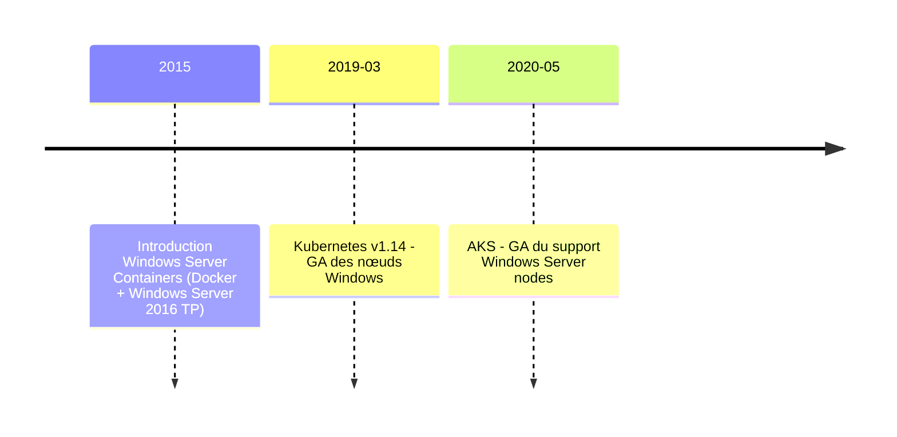
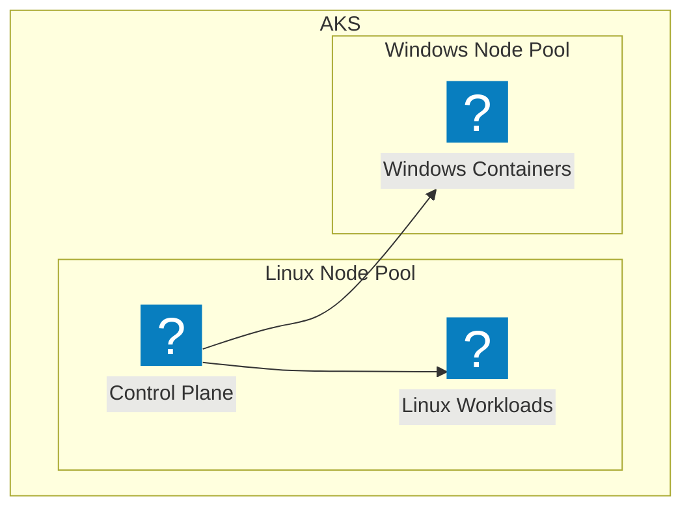

# Pendant ce temps...

<div>

</div>

---
layout: image-left
# the image source
image: /resources/aks_windows.png
---

# Idée FinOps : et si on pouvait tout mettre dans Kubernetes ?

<v-clicks>

- 1 seul Application gateway, avec Ingress Controller (AGIC)
- packaging unique (images Docker)
- tous rangés dans un registre unique 
- Pipeline CD unifié (déploiement avec Helm)
- 1 seule plateforme pour toutes nos applications

</v-clicks>

<div class="mt-5 bg-green-30 dark:bg-green-500 p-3 rounded-lg" v-click>
    <h4 class="text-sm font-bold mb-2">Gains ?</h4>
    <ul class="text-sm">
        <li>Baisse des coûts d'infra (mutualisation)</li>
        <li>Moins de maintenance (du moins, sur papier!)</li>
    </ul>
</div>

<!--
Notes du présentateur: Expliquer pourquoi les applications legacy Windows sont problématiques dans un environnement cloud moderne.
-->


---
layout: image-right
image: /resources/aks_workshop_with_microsoft.png
---

# Mise en oeuvre du projet pilote

Accompagné par Microsoft nous avons :

<v-clicks>

- testé la conteneurisation d'une application legacy Windows en local

- créé un cluster AKS avec support Windows

- déployé notre application legacy Windows dans AKS

- exposé l'application via Application Gateway avec AGIC

- testé la montée en charge des applications

- puis mis à l'échelle !
</v-clicks>

---
layout: two-cols
---

# Qu'est-ce qu'un Windows Container?

<v-clicks>

- Isoler des applications Windows dans des conteneurs
- Deux types:
  - Windows Server Core (complet)
  - Windows Nano Server (minimal)
- Mêmes principes que les conteneurs Linux
- Partage le noyau Windows de l'hôte
- Support inclus dans Docker Desktop

</v-clicks>


::right::

  

  <div v-click="6" class="flex flex-col items-center">
    <div class="flex gap-5 mb-5">
      <carbon-container-registry class="text-5xl" />
      <!-- <carbon-logo-microsoft class="text-5xl" /> -->
    </div>

````md magic-move
```dockerfile {all|1-2|4-6|8} {at:5}
# Exemple de Dockerfile Windows
FROM mcr.microsoft.com/dotnet/framework/aspnet:4.8

WORKDIR /inetpub/wwwroot

COPY ./website/ .

EXPOSE 80
```
```dockerfile {all|1|3-5|7-8|10|11-12|all} {at:5}
FROM mcr.microsoft.com/dotnet/framework/sdk:4.8.1 AS builder

WORKDIR C:/Temp
COPY . .
COPY ./Config/* ./LegacyApp/ 

WORKDIR C:/Temp/LegacyApp
RUN msbuild.exe

FROM mcr.microsoft.com/dotnet/framework/aspnet:4.8.1 AS final

COPY --from=builder "C:\\Temp\\LegacyApp\\" /inetpub/wwwroot/ 
COPY ./Config/web.config /inetpub/wwwroot/web.config

EXPOSE 80
```
````

  </div>

<!--
Notes du présentateur: Introduction aux concepts des Windows Containers et différences avec Linux.
-->

---

# POC : Dockerfile Windows

```dockerfile {all|1|3-6|8-11|13-15|17-20}
FROM mcr.microsoft.com/dotnet/framework/aspnet:4.8.1-windowsservercore-ltsc2025

# Variables d'environnement
ENV WEBSITE_NAME="LegacyApp" \
    APP_POOL_NAME="LegacyAppPool" \
    APP_POOL_IDENTITY="NetworkService"

# Installation des features IIS requises
RUN powershell -Command \
    Add-WindowsFeature Web-ASP-Net45; \
    Add-WindowsFeature Web-Windows-Auth; \
    Add-WindowsFeature Web-Http-Logging

# Copie des fichiers de l'application
COPY ./Application/ /inetpub/wwwroot/LegacyApp/
COPY ./Config/web.config /inetpub/wwwroot/LegacyApp/web.config

# Configuration d'IIS
RUN powershell -Command \
    Import-Module WebAdministration; \
    New-WebAppPool -Name $env:APP_POOL_NAME; \
    New-Website -Name $env:WEBSITE_NAME -Port 80 -PhysicalPath "C:\inetpub\wwwroot\LegacyApp" -ApplicationPool $env:APP_POOL_NAME

EXPOSE 80
```


---
layout: two-cols
---

# Déploiement sur AKS

<v-clicks>

- Configuration du cluster AKS
  - Control plane Linux
  - Node pools Windows et Linux
- Options de réseau
- Storage classes Windows compatibles
- Gestion des licences Windows

</v-clicks>

<div class="mt-5">
  <v-click>
```bash
# Création d'un cluster AKS avec node pool Windows
az aks create \
    --resource-group myResourceGroup \
    --name myAKSCluster \
    --node-count 1 \
    --enable-addons monitoring \
    --generate-ssh-keys

# Ajouter un node pool Windows
az aks nodepool add \
    --resource-group myResourceGroup \
    --cluster-name myAKSCluster \
    --os-type Windows \
    --name winpool \
    --node-count 1
```
  </v-click>
</div>

::right::

<div class="pl-10 pt-10">
  <v-click>
    <div class="mermaid">

</div>
  </v-click>

  <div class="mt-10">
    <v-click>
      <div class="bg-blue-50 dark:bg-blue-900 p-3 rounded-lg">
        <h4 class="text-sm font-bold mb-2">Points d'attention</h4>
        <ul class="text-sm">
          <li>Version Windows Server de l'image = version du node</li>
          <li>Limitations des fonctionnalités réseau</li>
          <li>Taille des images (10GB+ parfois)</li>
        </ul>
      </div>
    </v-click>
  </div>
</div>

<!--
Notes du présentateur: Configuration spécifique pour AKS avec Windows, points d'attention particuliers.
-->
