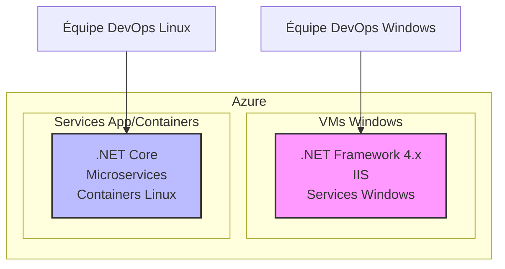

# L'environnement hybride traditionnel

  

  

<v-clicks>

- Équipes et compétences séparées
- Coûts d'infrastructure doublés
- Cycles de déploiement différents
- Problèmes d'intégration entre les systèmes

</v-clicks>

<!--
Notes du présentateur: Montrer les silos et la duplication des efforts dans un environnement hybride.
-->
