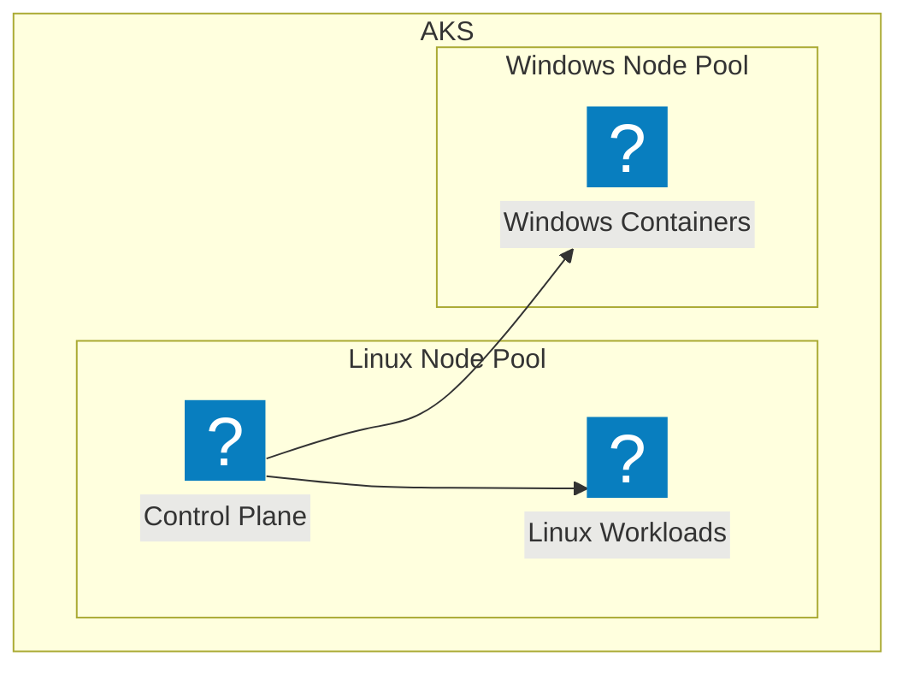

# Déploiement sur AKS

<v-clicks>

- Configuration du cluster AKS
  - Control plane Linux
  - Node pools Windows et Linux
- Options de réseau
- Storage classes Windows compatibles
- Gestion des licences Windows

</v-clicks>

<div class="mt-5">
  <v-click>
```bash
# Création d'un cluster AKS avec node pool Windows
az aks create \
    --resource-group myResourceGroup \
    --name myAKSCluster \
    --node-count 1 \
    --enable-addons monitoring \
    --generate-ssh-keys

# Ajouter un node pool Windows
az aks nodepool add \
    --resource-group myResourceGroup \
    --cluster-name myAKSCluster \
    --os-type Windows \
    --name winpool \
    --node-count 1
```
  </v-click>
</div>

::right::

<div class="pl-10 pt-10">
  <v-click>
    <div class="mermaid">

</div>
  </v-click>

  <div class="mt-10">
    <v-click>
      <div class="bg-blue-50 dark:bg-blue-900 p-3 rounded-lg">
        <h4 class="text-sm font-bold mb-2">Points d'attention</h4>
        <ul class="text-sm">
          <li>Version Windows Server de l'image = version du node</li>
          <li>Limitations des fonctionnalités réseau</li>
          <li>Taille des images (10GB+ parfois)</li>
        </ul>
      </div>
    </v-click>
  </div>
</div>

<!--
Notes du présentateur: Configuration spécifique pour AKS avec Windows, points d'attention particuliers.
-->
