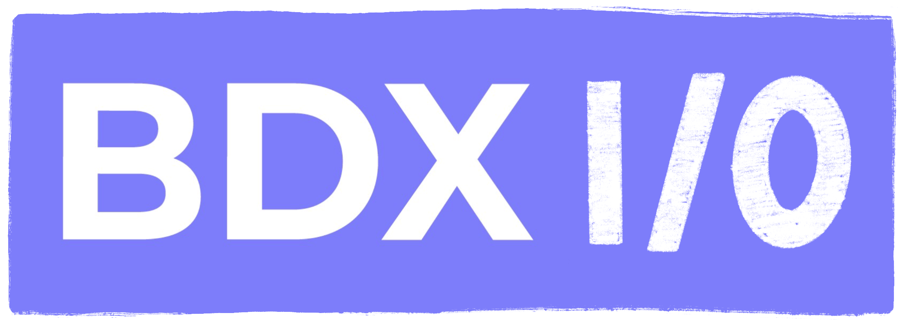
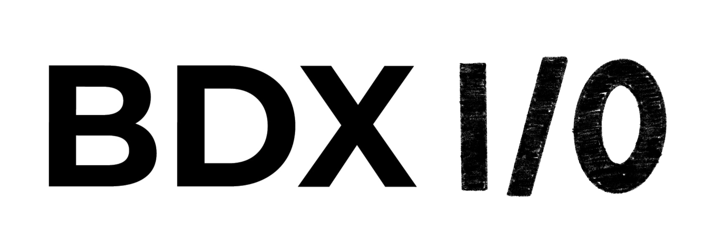

<!-- Slide 1: Titre & Branding -->
# Oui, Kubernetes peut faire tourner vos applis Windows. Sérieusement.

---

<!-- Slide 2: Pitch -->
## Pitch

Et si vous pouviez vraiment TOUT mettre dans Kubernetes — même vos vieilles applis Windows/IIS ?
Ce talk explore comment containeriser des applications legacy Windows et les exécuter efficacement sur Kubernetes. Une opportunité de moderniser sans tout réécrire, tout en tirant profit de l’écosystème Kube (Helm, CI/CD, scalabilité, etc.). Oui, c’est possible, et on vous montre comment !

---

<!-- Slide 3: Contexte & Problématique -->
## Contexte

Beaucoup d'entreprises traînent encore des applications historiques Windows (IIS, .NET Framework 4.x, COM+, etc.).

- Hors des process DevOps modernes
- Mal isolées
- Monopolisent des VMs coûteuses

---

<!-- Slide 4: Objectifs du talk -->
## Objectifs

- Poser le contexte d'un environnement cloud hybride
- Montrer la maintenance spécifique pour chaque techno/OS
- Introduire la notion de WindowsContainer
- Déployer sur AKS
- Intégrer CI/CD (Helm, Docker registry)
- Identifier les limites
- Montrer les bénéfices

---

<!-- Slide 5: Public visé -->
## Public visé

Développeurs, SREs, DevOps et architectes qui ont un pied dans le passé (legacy) et l’autre dans le cloud natif.

---

<!-- Slide 6: Démo / Containerisation -->
## Démo: Containeriser une appli Windows

- Dockerfile Windows
- Registry
- Déploiement AKS

---

<!-- Slide 7: Limites & Points d’attention -->
## Limites

- Licences
- Performance
- Limitations Windows ServerCore vs Nano

---

<!-- Slide 8: Bénéfices -->
## Bénéfices

- Scalabilité
- Homogénéité des déploiements
- Meilleure observabilité

---

<!-- Slide 9: Questions & Contact -->
# Questions ?

Nicolas Boisseau

---

<!-- Slide 10: Merci & Branding -->
# Merci !

---

<!-- Astuces reveal.js: Fragments, backgrounds, etc. à personnaliser selon tes besoins -->
