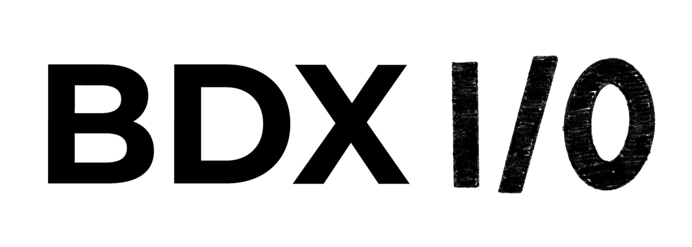

= Oui, Kubernetes peut faire tourner vos applis Windows. Sérieusement.
:revealjs_theme: white
:revealjs_customtheme: bdxio-theme.css
:revealjs_slideNumber: true
:revealjs_progress: true
:revealjs_controls: true
:revealjs_transition: slide
:revealjs_backgroundTransition: fade
:source-highlighter: highlight.js
:icons: font

[.notes]
--
Présentation de 15 minutes pour BDXIO - Novembre 2025
--

// Slide titre
[background-color="#1e3a8a"]
== Oui, Kubernetes peut faire tourner vos applis Windows. Sérieusement.

[.lead]
Containeriser et orchestrer vos applications legacy Windows avec Kubernetes

'''

*Présentateur* +
BDXIO - Novembre 2025

[.notes]
--
Introduction accrocheuse - montrer que même les applis Windows legacy peuvent bénéficier de Kubernetes
Durée : 1 minute
--

== Le problème : vos applis Windows legacy

[%step]
* Applications Windows historiques (IIS, .NET Framework 4.x, COM+)
* Hors des processus DevOps modernes
* VMs dédiées coûteuses à maintenir
* Isolation défaillante
* Scalabilité limitée

[.notes]
--
Identifier les douleurs actuelles
Durée : 2 minutes
--

== Et si on les mettait dans Kubernetes ? 🤔

[%step]
* Windows Containers + Kubernetes = ✨ Magic ✨
* Scheduling multi-OS natif
* Même orchestrateur pour Linux ET Windows
* Homogénéisation des déploiements

[.notes]
--
Présenter la solution - Kubernetes peut gérer Windows ET Linux
Durée : 1 minute
--

== Demo Time! 🚀

=== Étape 1 : Containeriser l'application Windows

[source,dockerfile]
----
FROM mcr.microsoft.com/dotnet/framework/aspnet:4.8-windowsservercore-ltsc2022
WORKDIR /inetpub/wwwroot
COPY . .
EXPOSE 80
----

[%step]
* Base image Windows Server Core
* Support .NET Framework complet
* Compatibilité avec les dépendances COM+

[.notes]
--
Montrer la containerisation - plus simple qu'on ne le pense
Durée : 3 minutes
--

=== Étape 2 : Déploiement sur AKS

[source,yaml]
----
apiVersion: apps/v1
kind: Deployment
metadata:
  name: legacy-app
spec:
  replicas: 3
  selector:
    matchLabels:
      app: legacy-app
  template:
    spec:
      nodeSelector:
        kubernetes.io/os: windows
----

[%step]
* Node selector pour Windows
* Scaling horizontal automatique
* Rolling updates supportés

[.notes]
--
Configuration Kubernetes spécifique Windows
Durée : 3 minutes
--

== Architecture multi-OS dans Kubernetes

[%step]
* Nodes Linux + Nodes Windows
* Scheduler intelligent
* Réseau unifié (Calico/Azure CNI)
* Storage partagé possible

[.notes]
--
Expliquer l'architecture hybride
Durée : 2 minutes
--

== Les bénéfices concrets

[cols="1,1", frame="none", grid="none"]
|===
a|
**Avant** +

* VMs dédiées
* Déploiements manuels
* Pas de scalabilité
* Monitoring limité

a|
**Après** +

* Containers orchestrés
* CI/CD avec Helm
* Auto-scaling
* Observabilité complète
|===

[.notes]
--
Comparaison avant/après - ROI clair
Durée : 2 minutes
--

== Les limitations à connaître

[%step]
* 🏷️ **Licences** : Windows Server Core requis
* ⚡ **Performance** : Overhead plus important que Linux
* 📦 **Images** : Plus volumineuses (plusieurs GB)
* 🔧 **Limitations** : Pas toutes les features K8s supportées

[.notes]
--
Être transparent sur les défis
Durée : 1 minute
--

== Conclusion : C'est possible et ça marche ! ✅

[%step]
* Modernisation progressive sans réécriture
* Uniformisation des outils DevOps  
* ROI positif sur les applications critiques
* L'écosystème cloud-native accessible à Windows

[.fragment.highlight-blue]
**Alors, prêts à mettre vos applis Windows dans Kubernetes ?**

[.notes]
--
Message final optimiste et actionnable
Appel à l'action
Durée : 1 minute pour conclusion + questions
--

[background-color="#1e3a8a"]
== Questions ?

'''

Merci ! 🙏

*Des questions sur Windows Containers + Kubernetes ?*

[.notes]
--
Session de questions
Prévoir 2-3 minutes pour les questions si le timing le permet
--
