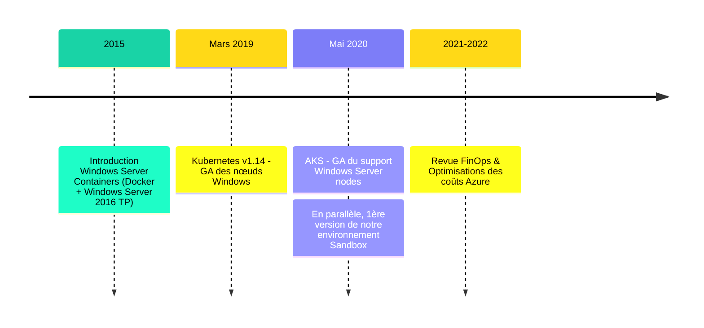
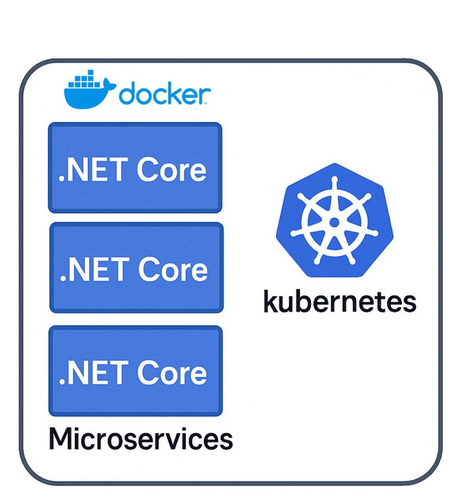
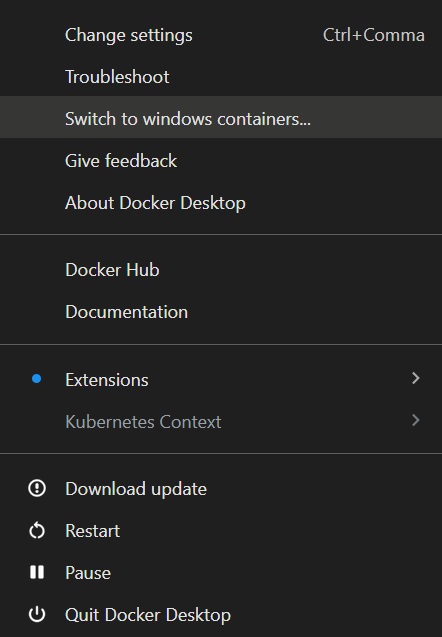
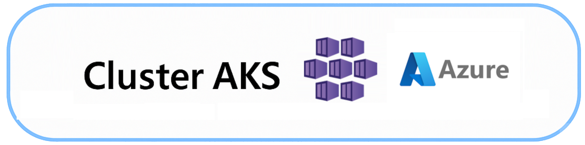
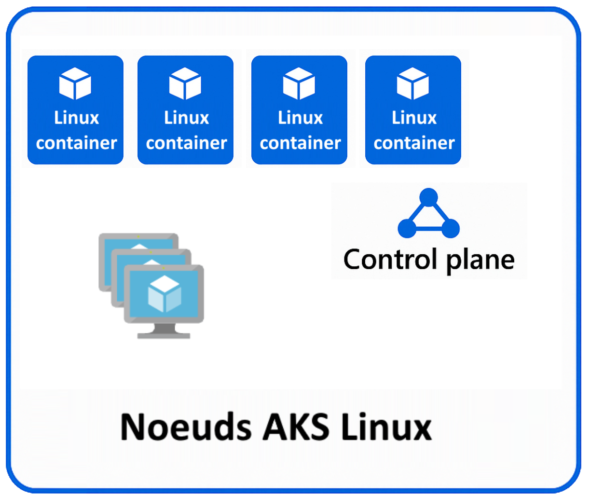
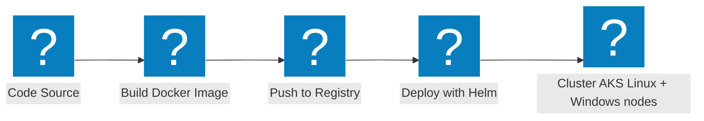
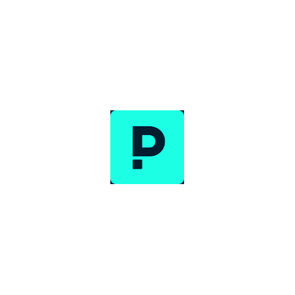

```mermaid
architecture-beta
    group vnet(azure:virtual-networks)[VNET]
    service user(carbon:user)[User Browser]
    service lb(azure:application-gateways)[App GW] in vnet
    service appService(azure:app-services)[App Services] in vnet
    user:R -- L:lb
    lb:R -- L:appService
```

```mermaid
architecture-beta
    group vnet(azure:virtual-networks)[VNET]
    service user(carbon:user)[User Browser]
    service lb(azure:application-gateways)[App GW] in vnet
    service appService(azure:app-services)[App Services] in vnet
    service lb_aks(azure:application-gateways)[App GW AKS with Ingress Controller] in vnet
    service aks(azure:kubernetes-services)[AKS Cluster] in vnet
    user:R -- L:lb
    lb:R -- L:appService
    user:B --> L:lb_aks
    lb_aks:R --> L:aks    
```

# Oui, Kubernetes peut faire tourner vos applis Windows. Sérieusement.

<div class="flex justify-center">
  <p>
     <logos:microsoft-icon class="text-5xl inline-block mr-2" />  <carbon:add class="text-5xl inline-block mx-2" /> <logos:kubernetes class="text-5xl inline-block ml-2" /> <carbon:binding-01 class="text-5xl inline-block mx-2" /> <carbon-favorite-filled class="text-red-500 text-5xl inline-block mx-2" />
  </p>
</div>

<div class="flex justify-center">
  
</div>

<!--
Notes du présentateur: Introduction personnelle et remerciement à BDX.IO
-->

---
layout: full
---

# Présentation

<div class="flex gap-5 mt-30 mb-10">
  
  <div class="text-left mt-5 mr-2">
    <h2 class="text-3xl font-bold">Nicolas Boisseau</h2>
    <p class="text-lg">Staff Engineer @ Peaksys</p>
    <p class="text-sm italic">#Archi #DevOps #Azure #FinOps #Kubernetes</p>
  </div>
  
</div>

<div class="absolute top-55 right-15">

</div>

<!--
Role chez Peaksys
-->

---

# L'avènement des Windows Containers

<div>


</div>

<!--
Notes du présentateur: 
1ère version de Docker (linux) en mars 2013

Docker for Windows en preview en 2015 - introduit dans Windows server 2016
-->

---
layout: two-cols-header
transition: slide-up
---

# Un peu de contexte : un cas pratique

## Notre plateforme de paiement SaaS : un système hybride

::left::
<div class="m-5 mt--20">
  

  <ul class="text-4">
    <li class="mb-5">Backend Windows-only<br/>(.NET Framework, IIS)</li>
    <li>Traditionnellement installé sur des VM</li>
  </ul>
</div>

::right:: 

<div class="m-5 mt--20">
  

 <ul class="text-4">
        <li class="mb-5">Backend moderne<br/>(.NET Core, Node.js, etc.)</li>
        <li>Conteneurisé (Docker)</li>
        <li>Déployé dans Kubernetes</li>
      </ul>
</div>

<!--
Notes du présentateur: 

produit SaaS de paiement qui a évolué au fil du temps

comme tout produit qui a vécu, on traine du legacy mais on a aussi des parties modernes (cloud native)

-->

---

# Environnement Cloud Azure

## Hébergement hybride

<div class="grid grid-cols-3 gap-3">

  <div class="col-span-2">

<!--
Animations sur du mermaid : workaround avec un v-switch
https://github.com/slidevjs/slidev/issues/1498
-->

  <v-switch>
    <template #1>      

    </template>
    <template #3>

   </template>
  </v-switch> 
</div>

  <div class="">
   
  <FancyArrow from="(720, 150)" to="(550, 220)" color="white" width="4" roughness="2"  v-click="1" />


  <FancyArrow from="(690, 350)" to="(550, 380)" color="white" width="4" roughness="2" v-click="3"  />
  

  </div>
</div>


<!--
Notes du présentateur: Agenda de la présentation
-->

---
layout: image-left
image: resources/double_hosting_legacy_and_modern.png
---

# Ça ne va pas ?

<table>
<thead>
  <tr>
    <td>
      
      <span class="text-sm text-yellow-500 pl-2">Legacy</span>
    </td>
    <td>
      
      <span class="text-sm text-turquoise-500 pl-2">Moderne</span>
    </td>
  </tr>
  </thead>
  <tbody>
  <tr>
    <td class="text-sm">
      Packaging .zip<br/>
      Pipelines App Services<br/>
      Logs fichiers dans les App Services<br/>
      Ecosystème AppService<br/>
    </td>
    <td class="prose-sm">
      Images Docker<br/>
      Pipelines Helm -> AKS<br/>
      Logs via stdout/stderr<br/>
      Ecosystème Kubernetes<br/>
    </td>
  </tr>

  <tr >
    <td class="text-lg text-center" colspan="2">
      <span v-mark="{ at:1, color: 'red', type: 'highlight' }">
        Maintenance globale       
        <strong class="text-xl">x2</strong>
      </span>
      <br/>
      (infra, packaging, pipelines, monitoring, etc.)
    </td>
  </tr>
  </tbody>
  
</table>

<!--
<div>
#### Pour le legacy

- Packages .zip
- Pipelines App Services
- Logs fichiers dans les App Services

</div>
  

<div v-click>

#### Pour le moderne

  - Images Docker
  - Helm Charts
  - Pipelines AKS
  - Logs via stdout/stderr
  - Monitoring via Azure Monitor et Log Analytics

</div>
-->

---
layout: image-left
# the image source
image: resources/aks_windows.png
---

# Idée FinOps : et si on pouvait tout mettre dans Kubernetes ?

- 1 seul Application gateway, avec Ingress Controller (AGIC)
- packaging unique (images Docker)
- tous rangés dans un registre unique 
- Pipeline CD unifié (déploiement avec Helm)
- 1 seule plateforme pour toutes nos applications

<div class="mt-5 bg-green-30 dark:bg-green-500 p-3 rounded-lg w-70">
    <h4 class="text-sm font-bold mb-2">Gains ?</h4>
    <ul class="text-sm">
        <li>Baisse des coûts (mutualisation)</li>
        <li>Moins de maintenance</li>
    </ul>
</div>

<!--
Notes du présentateur: Expliquer pourquoi les applications legacy Windows sont problématiques dans un environnement cloud moderne.
-->

---
layout: image-right
image: resources/aks_workshop_with_microsoft.png
---

# Mise en oeuvre du projet pilote

<div class="mt-5">

  Accompagné par Microsoft nous avons :

  <!-- <v-clicks> -->

  - testé la conteneurisation d'une app en local

  - créé un cluster AKS avec support Windows

  - déployé notre application legacy dans AKS

  - exposé l'application via Application Gateway

  - testé la montée en charge des applications

  - puis mis à l'échelle !

  <!-- </v-clicks> -->
</div>

---
layout: two-cols
---

# Qu'est-ce qu'un Windows Container?

- Isoler des applications Windows dans des conteneurs
- Mêmes principes que les conteneurs Linux
- Partage le noyau Windows de l'hôte
- Support inclus dans Docker Desktop

::right::

  

  <div v-click="1" class="flex flex-col items-center">
    <div class="flex gap-5 mb-5">
      <carbon-container-registry class="text-5xl" />
      <!-- <carbon-logo-microsoft class="text-5xl" /> -->
    </div>

````md magic-move
```dockerfile {all|1-2|4-6|8}{at:1}
# Exemple de Dockerfile Windows
FROM mcr.microsoft.com/dotnet/framework/aspnet:4.8

WORKDIR /inetpub/wwwroot

COPY ./website/ .

EXPOSE 80
```
```dockerfile {all|1|3-5|7-8|10|12-13|all}{at:1}
FROM mcr.microsoft.com/dotnet/framework/sdk:4.8.1 AS builder

WORKDIR C:/Temp
COPY . .
COPY ./Config/* ./LegacyApp/ 

WORKDIR C:/Temp/LegacyApp
RUN msbuild.exe

FROM mcr.microsoft.com/dotnet/framework/aspnet:4.8.1 AS final

COPY --from=builder "C:\\Temp\\LegacyApp\\" /inetpub/wwwroot/ 
COPY ./Config/web.config /inetpub/wwwroot/web.config

EXPOSE 80
```
````

  </div>

<!--
Références : 
https://learn.microsoft.com/en-us/virtualization/windowscontainers/manage-containers/container-base-images
-->

---

# Configuration AKS avec support Windows

<div class="w-100 float-left">
  <v-click>

```bash{1-8|1-8|10-16|all}{at:2}
# Création d'un cluster AKS (Linux nodes)
az aks create \
    --resource-group myResourceGroup \
    --name myAKSCluster \
    --node-count 1 \
    --enable-addons monitoring \
    --generate-ssh-keys \
    --network-plugin azure

# Ajouter un node pool Windows
az aks nodepool add \
    --resource-group myResourceGroup \
    --cluster-name myAKSCluster \
    --os-type Windows \
    --name winpool \
    --node-count 1
```

  </v-click>
</div>

<div class="w-100 float-right relative">

  

  <FancyArrow from="(150, 70)" to="(110, 130)" color="white" width="4" roughness="2" v-click="2"  />
  
  
  <FancyArrow from="(250, 70)" to="(300, 130)" color="white" width="4" roughness="2" v-click="3"  />
  
  
</div>

<!-- <div class="absolute bottom-3 left-60 w-1/2" v-click="4">
    <v-click>
      <div class="bg-blue-50 dark:bg-blue-900 p-3 rounded-lg">
        <h5 class="font-bold mb-2">Points d'attention</h5>
        <ul class="text-xs">
          <li>Version Windows Server de l'image = version du node</li>
          <li>Limitations des fonctionnalités réseau (Azure CNI obligatoire)</li>
          <li>Gestion des mises à jour Windows</li>
        </ul>
      </div>
    </v-click>
  </div> -->

<!--
doc: https://learn.microsoft.com/en-us/azure/aks/learn/quick-windows-container-deploy-cli?tabs=add-windows-node-pool

Limitations réseaux : 

En AKS hybride, faites simple : Ingress sur Linux, workloads .NET Framework sur Windows, Azure CNI obligatoire pour Windows, pas de Cilium côté Windows aujourd’hui.

Les NetworkPolicies fonctionnent pour Windows via Azure NPM/Calico, mais gardez en tête des lacunes de correspondance/capacités par rapport à Linux.

-->

---
layout: two-cols
---

# Kubernetes multi-OS

<div class="mt-20">
  
- Kubernetes 1.14+ supporte les nœuds Windows
- Scheduling basé sur nodeSelector ou nodeAffinity
- Pod assignation basée sur les contraintes OS
- Networking multi-OS (avec Azure CNI)
- Un control plane Linux obligatoire

</div>

::right::

  <div class="w-120 mt-30">

```yaml {all|6-7}
apiVersion: v1
kind: Pod
metadata:
  name: windows-iis-pod
spec:
  nodeSelector:
    kubernetes.io/os: windows
  containers:
  - name: iis
    image: mcr.microsoft.com/windows/servercore/iis:latest
    ports:
    - containerPort: 80
```

  </div>

  <FancyArrow from="(920, 200)" to="(750, 265)" color="white" width="4" roughness="2"  v-click="1" />

<div class="absolute bottom-12 left-60 w-1/2" v-click="1">
  
  <blockquote class="text-sm italic">
    <span class="underline font-bold">En résumé</span> :<br/>
    <span>&nbsp;&nbsp;&nbsp;&nbsp;</span>"Un cluster Kubernetes peut gérer des nœuds Linux et Windows dans le même cluster, mais les pods sont assignés à des nœuds spécifiques en fonction de leur système d'exploitation."
  </blockquote>
</div>

<!--
Notes du présentateur: Expliquer comment Kubernetes gère différentes plateformes d'OS dans un même cluster.
-->

---

# Intégration CI/CD avec Helm

### Déploiement avec Helm dans des pipelines modernes

<div class="mt-5 mb-5">

```bash {none|1|3|4-7|all}
docker build -t myregistry.azurecr.io/legacy-app:$VERSION .

docker push myregistry.azurecr.io/legacy-app:$VERSION

helm upgrade --install legacy-app ./charts/legacy-app \
      --set image.tag=myregistry.azurecr.io/legacy-app:$VERSION \
      --namespace my-namespace
```

</div>

<div v-click="4">

  ### Un workflow identique pour toutes les applications

  

  <div class="mt-5 ml-30">
  

  </div>
</div>

<!--
Notes du présentateur: Intégration dans une chaîne CI/CD avec des outils modernes, spécificités de Windows.
-->

---
layout: two-cols
title: Bénéfices & Limitations
---

# Bénéfices

- Uniformisation de l'infrastructure
- Optimisation des coûts (FinOps)
- Intégration aux <span v-mark="{ at:1, color: 'green', type: 'underline' }">pratiques DevOps modernes</span>
- Observabilité améliorée
- Scalabilité et haute disponibilité
- Transition progressive vers le cloud natif

<div class="mt-20">
  
  <blockquote class="text-sm italic">
    "Grâce à cette approche, nous avons réduit nos coûts d'infrastructure tout en améliorant la résilience de nos applications Windows legacy."
  </blockquote>
</div>

::right::

# Limitations

- <span v-mark="{ at:2, color: 'red', type: 'underline' }">Taille des images</span> (10GB+)
- Compatibilité des versions Windows
- Performance de démarrage
- Besoin de licences Windows
- Limitations du networking
- Mises à jour Windows... mais gérées via des images
- Gestion des logs... mais <span v-mark="{ at:3, color: 'green', type: 'underline' }">LogMonitor</span>  aide !

<!--
Notes du présentateur: Résumé des avantages et limitations de l'approche, retours d'expérience.

Immutable infrastructure : les mises à jour de sécurité et correctifs Windows sont gérés via des nouvelles images de base.

https://learn.microsoft.com/en-us/azure/aks/windows-best-practices
https://learn.microsoft.com/en-us/azure/aks/upgrade-windows-os
-->

---
layout: center
class: text-center
background: './public/resources/bdxio-kit-communication/illustrations/bridge-background-blue-large.png'
---

# Conclusion

<div class="text-2xl mb-10" v-click>
  Modernisez vos applications Windows sans les réécrire
</div>

<div class="grid grid-cols-3 gap-5" v-click>
  <div class="bg-white/10 backdrop-blur-sm p-5 rounded-lg">
    <carbon-container-software class="text-4xl mb-3" />
    <h3>Conteneurisation</h3>
    <p class="text-sm">Empaquetez vos apps Windows dans des conteneurs</p>
  </div>
  
  <div class="bg-white/10 backdrop-blur-sm p-5 rounded-lg">
    <carbon-kubernetes class="text-4xl mb-3" />
    <h3>Orchestration</h3>
    <p class="text-sm">Gérez-les avec les mêmes outils que vos workloads Linux</p>
  </div>
  
  <div class="bg-white/10 backdrop-blur-sm p-5 rounded-lg">
    <carbon-cloud-service-management class="text-4xl mb-3" />
    <h3>Évolution</h3>
    <p class="text-sm">Préparez la transition vers des architectures cloud natives</p>
  </div>
</div>

<div class="mt-10" v-click>
  
  <p class="text-lg mt-2">Merci pour votre attention!</p>
</div>

<!--
Notes du présentateur: Conclusion et message principal à retenir.
-->

---
layout: two-cols
title: Questions & Réponses
---

<div class="mt-15 p-5 relative text-center">

  <div class="flex justify-center items-center">
    <carbon-help class="text-6xl" />
  </div>

  # Questions & Réponses

  
  

  <div class="mt-12 text-sm italic text-center">
    
    <br/>
    <div class="mt-5 text-7">Retrouvez les slides ici</div>
      </div>

</div>

::right::



<div class="text-sm text-center">
  <h3 class="italic mt-5 text-7">Donnez votre avis !</h3>
  <p class="text-sm">Scannez le QR code pour accéder au formulaire OpenFeedback et partager vos impressions.</p>
</div>

<!--
Notes du présentateur: Préparer quelques réponses aux questions fréquentes.
-->

---

# Annexes

Documentation autour des Windows Containers :
- [Setup Windowscontainers](https://learn.microsoft.com/fr-fr/virtualization/windowscontainers/quick-start/set-up-environment?tabs=dockerce)
- [Windows Containers overview](https://learn.microsoft.com/en-us/virtualization/windowscontainers/)
- [Windows vs Linux containers](https://learn.microsoft.com/en-us/azure/aks/windows-vs-linux-containers)
- [Windows containers images](https://learn.microsoft.com/en-us/virtualization/windowscontainers/manage-containers/container-base-images)
- [.NET Framework docker images](https://mcr.microsoft.com/en-us/artifact/mar/dotnet/framework/aspnet/tags)

Ressources additionnelles autour des Windows Containers :
- [LogMonitor pour le forward des logs sur stdout/err](https://github.com/microsoft/windows-container-tools/blob/main/LogMonitor/README.md)