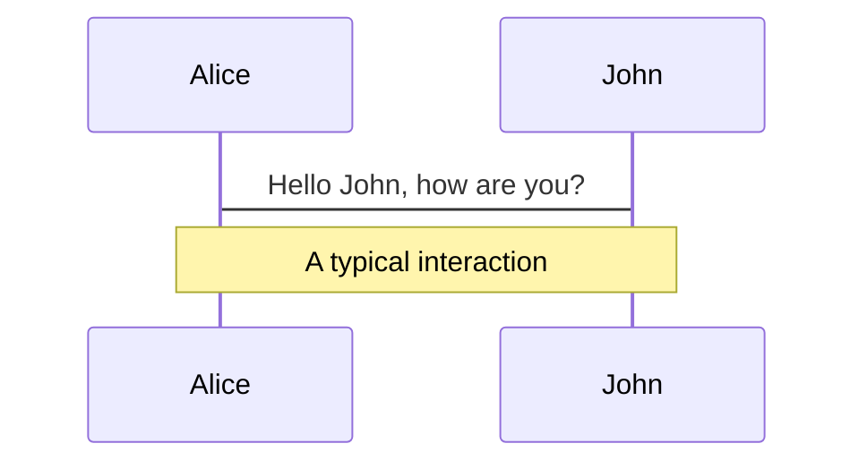
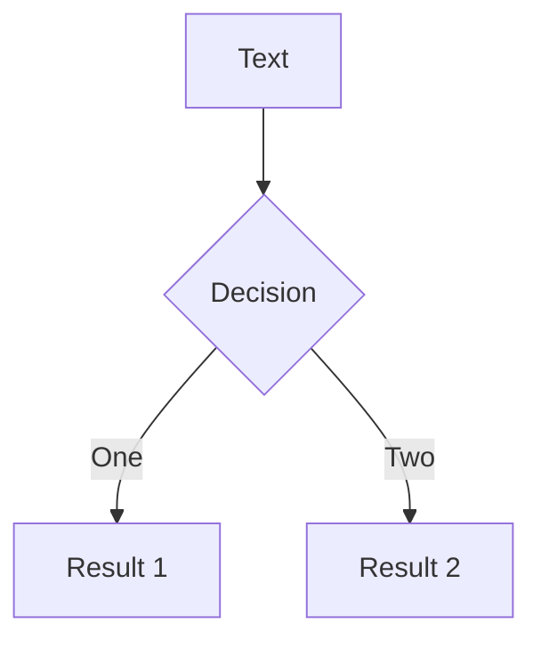
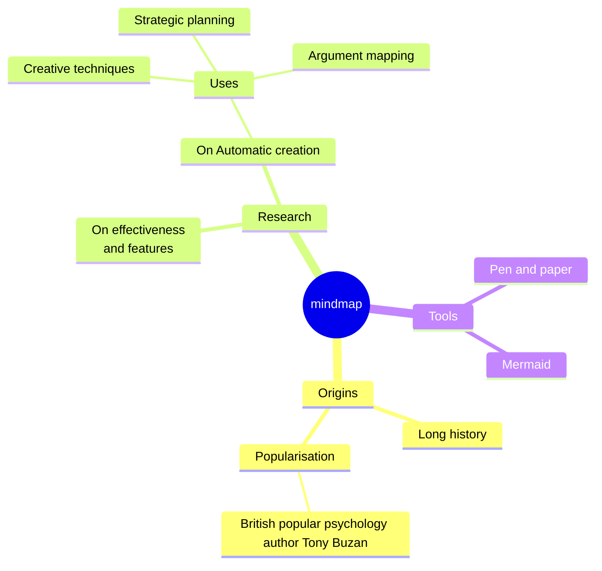
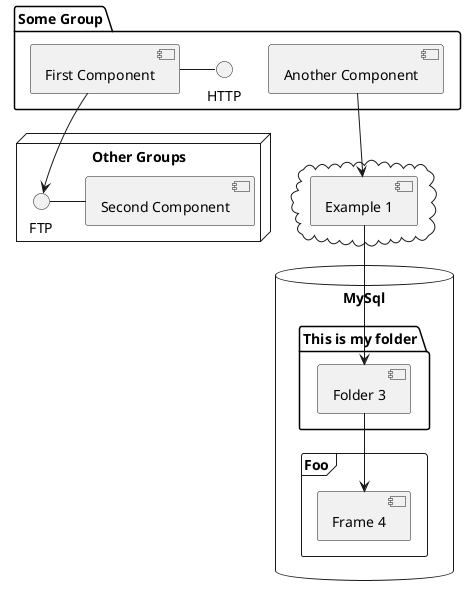

# Oui, Kubernetes peut faire tourner vos applis Windows. Sérieusement.

<div class="flex justify-center">
  
</div>

<div class="abs-br m-6 flex gap-2">
  <a href="https://bdxio.fr" target="_blank" alt="BDX.IO Website">
    
  </a>
  <a href="https://github.com/nicolas-boisseau" target="_blank" alt="GitHub Profile" class="text-xl icon-btn opacity-50 !border-none !hover:text-white">
    <carbon-logo-github />
  </a>
</div>

<!--
Notes du présentateur: Introduction personnelle et remerciement à BDX.IO
-->

---
layout: two-cols
---

# Aujourd'hui


<v-clicks>

- Le problème des applications legacy Windows
- Windows Containers: principes et limitations
- Kubernetes et le scheduling multi-OS
- Démonstration: containeriser une application .NET Framework
- Déploiement sur AKS (Azure Kubernetes Service)
- Intégration CI/CD avec Helm
- Bénéfices et limites de l'approche
- Questions & Réponses

</v-clicks>

::right::

<div class="flex flex-col h-full justify-center pl-10">
  
</div>

<!--
Notes du présentateur: Agenda de la présentation
-->

---
layout: center
background: './start_kit/bdxio-kit-communication/illustrations/bridge-background-blue-small.png'
class: text-center
---

# Le problème des applications legacy Windows

<div class="flex justify-around">
  <div class="flex flex-col items-center" v-click>
    <carbon-virtual-machine class="text-5xl mb-2" />
    <AutoFitText :max="14" :min="5" modelValue="VMs dédiées et coûteuses"/>
  </div>
  <div class="flex flex-col items-center" v-click>
    <carbon-warning class="text-5xl mb-2" />
    <AutoFitText :max="14" :min="5" modelValue="Hors des process DevOps modernes"/>
  </div>
  <div class="flex flex-col items-center" v-click>
    <carbon-locked class="text-5xl mb-2" />
    <AutoFitText :max="14" :min="5" modelValue="Dépendances spécifiques et verrouillage"/>
  </div>
</div>

<div class="mt-10 w-2/3 mx-auto" v-click>
  
  <blockquote class="text-left">
    Beaucoup d'entreprises traînent encore des applications historiques Windows (IIS, .NET Framework 4.x, COM+, etc.)
  </blockquote>
</div>

---

# L'environnement hybride traditionnel

<div class="flex justify-center">
  <div class="mermaid w-full">
  flowchart TB
    subgraph Azure
      subgraph "VMs Windows"
        monolith[".NET Framework 4.x\nIIS\nServices Windows"]
      end
      subgraph "Services App/Containers"
        micro[".NET Core\nMicroservices\nContainers Linux"]
      end
    end
    devops1[Équipe DevOps Windows] --> monolith
    devops2[Équipe DevOps Linux] --> micro
    style monolith fill:#f9f,stroke:#333,stroke-width:2px
    style micro fill:#bbf,stroke:#333,stroke-width:2px
  </div>
</div>

<v-clicks>

- Équipes et compétences séparées
- Coûts d'infrastructure doublés
- Cycles de déploiement différents
- Problèmes d'intégration entre les systèmes

</v-clicks>


---
layout: two-cols
---

# Qu'est-ce qu'un Windows Container?

<v-clicks>

- Isoler des applications Windows dans des conteneurs
- Deux types:
  - Windows Server Core (complet)
  - Windows Nano Server (minimal)
- Mêmes principes que les conteneurs Linux
- Support de Docker
- Partage le noyau Windows de l'hôte

</v-clicks>


::right::

<div class="flex flex-col items-center">
  <v-click>
    <div class="flex gap-5 mb-5">
      <logos-docker-icon class="text-5xl" />
      <logos-microsoft-icon class="text-5xl" />
    </div>
  </v-click>

  <v-click>
    ```powershell {all|4,7,10}
    # Exemple de Dockerfile Windows
    FROM mcr.microsoft.com/dotnet/framework/aspnet:4.8
    
    WORKDIR /inetpub/wwwroot
    
    COPY ./website/ .
    
    RUN powershell -Command \
        Add-WindowsFeature Web-ASP-Net45
    
    EXPOSE 80
    ```
  </v-click>
</div>

---
layout: image-right
image: './start_kit/bdxio-kit-communication/illustrations/bridge-black.png'
---

# Kubernetes multi-OS

<v-clicks>

- Kubernetes 1.14+ supporte les nœuds Windows
- Scheduling basé sur nodeSelector ou nodeAffinity
- Pod assignation basée sur les contraintes OS
- Networking multi-OS (CNI)
- Un control plane Linux obligatoire

</v-clicks>

<div class="mt-5">
  <v-click>
    ```yaml {all|5-6}
    apiVersion: v1
    kind: Pod
    metadata:
      name: windows-iis-pod
    spec:
      nodeSelector:
        kubernetes.io/os: windows
      containers:
      - name: iis
        image: mcr.microsoft.com/windows/servercore/iis:latest
        ports:
        - containerPort: 80
    ```
  </v-click>
</div>


---
layout: center
background: './start_kit/bdxio-kit-communication/illustrations/bridge-background-blue-small.png'
---

# Démonstration

<div class="text-center mb-10">
  <h3>Containeriser une application .NET Framework legacy</h3>
</div>

<div class="grid grid-cols-2 gap-10">
  <div v-click>
    <h3>Étapes</h3>
    <ol class="mt-2">
      <li>Identifier les dépendances</li>
      <li>Choisir l'image de base</li>
      <li>Créer le Dockerfile</li>
      <li>Adapter les configurations</li>
      <li>Tester localement</li>
    </ol>
  </div>
  
  <div v-click>
    <div class="flex flex-col items-center">
      <carbon-container-software class="text-6xl mb-5" />
      <carbon-arrow-down class="text-2xl mb-5" />
      <carbon-kubernetes class="text-6xl" />
    </div>
  </div>
</div>


---

# Dockerfile pour une application .NET Framework

```dockerfile {all|1|3-6|8-11|13-15|17-20}
FROM mcr.microsoft.com/dotnet/framework/aspnet:4.8-windowsservercore-ltsc2019

# Variables d'environnement
ENV WEBSITE_NAME="LegacyApp" \
    APP_POOL_NAME="LegacyAppPool" \
    APP_POOL_IDENTITY="NetworkService"

# Installation des features IIS requises
RUN powershell -Command \
    Add-WindowsFeature Web-ASP-Net45; \
    Add-WindowsFeature Web-Windows-Auth; \
    Add-WindowsFeature Web-Http-Logging

# Copie des fichiers de l'application
COPY ./Application/ /inetpub/wwwroot/LegacyApp/
COPY ./Config/web.config /inetpub/wwwroot/LegacyApp/web.config

# Configuration d'IIS
RUN powershell -Command \
    Import-Module WebAdministration; \
    New-WebAppPool -Name $env:APP_POOL_NAME; \
    New-Website -Name $env:WEBSITE_NAME -Port 80 -PhysicalPath "C:\inetpub\wwwroot\LegacyApp" -ApplicationPool $env:APP_POOL_NAME

EXPOSE 80
```


---
layout: two-cols
---

# Déploiement sur AKS

<v-clicks>

- Configuration du cluster AKS
  - Control plane Linux
  - Node pools Windows et Linux
- Options de réseau
- Storage classes Windows compatibles
- Gestion des licences Windows

</v-clicks>

<div class="mt-5">
  <v-click>
    ```bash
    # Création d'un cluster AKS avec node pool Windows
    az aks create \
      --resource-group myResourceGroup \
      --name myAKSCluster \
      --node-count 1 \
      --enable-addons monitoring \
      --generate-ssh-keys
    
    # Ajouter un node pool Windows
    az aks nodepool add \
      --resource-group myResourceGroup \
      --cluster-name myAKSCluster \
      --os-type Windows \
      --name winpool \
      --node-count 1
    ```
  </v-click>
</div>

::right::

<div class="pl-10 pt-10">
  <v-click>
    <div class="mermaid">
    flowchart TB
      subgraph AKS
        subgraph "Linux Node Pool"
          cp[Control Plane]
          linux[Linux Workloads]
        end
        subgraph "Windows Node Pool"
          win[Windows Containers]
        end
      end
      
      cp --> win
      cp --> linux
    </div>
  </v-click>

  <div class="mt-10">
    <v-click>
      <div class="bg-blue-50 dark:bg-blue-900 p-3 rounded-lg">
        <h4 class="text-sm font-bold mb-2">Points d'attention</h4>
        <ul class="text-sm">
          <li>Version Windows Server de l'image = version du node</li>
          <li>Limitations des fonctionnalités réseau</li>
          <li>Taille des images (10GB+ parfois)</li>
        </ul>
      </div>
    </v-click>
  </div>
</div>

---

# Intégration CI/CD avec Helm

<div class="grid grid-cols-2 gap-5">
  <div>
    <v-click>
      <h3 class="mb-3">Manifestes Kubernetes</h3>
      ```yaml
      apiVersion: apps/v1
      kind: Deployment
      metadata:
        name: legacy-windows-app
      spec:
        replicas: 2
        selector:
          matchLabels:
            app: legacy-windows-app
        template:
          metadata:
            labels:
              app: legacy-windows-app
          spec:
            nodeSelector:
              kubernetes.io/os: windows
            containers:
            - name: legacy-app
              image: myregistry.azurecr.io/legacy-app:1.0
              ports:
              - containerPort: 80
      ```
    </v-click>
  </div>
  
  <div>
    <v-click>
      <h3 class="mb-3">Pipeline CI/CD</h3>
      ```yaml
      # Azure DevOps / GitHub Actions
      steps:
      - uses: actions/checkout@v3
      
      - name: Build Windows container
        run: |
          docker build -t myregistry.azurecr.io/legacy-app:${{ github.sha }} .
          docker push myregistry.azurecr.io/legacy-app:${{ github.sha }}
      
      - name: Deploy to AKS with Helm
        run: |
          helm upgrade --install legacy-app ./charts/legacy-app \
            --set image.tag=${{ github.sha }} \
            --namespace production
      ```
    </v-click>
  </div>
</div>

<div v-click class="mt-5">
  <h3 class="mb-3">Chart Helm</h3>
  <div class="flex">
    <div class="flex-1">
      ```yaml
      # values.yaml
      replicaCount: 2
      image:
        repository: myregistry.azurecr.io/legacy-app
        tag: latest
      resources:
        limits:
          cpu: 1
          memory: 2Gi
      ```
    </div>
    <div class="flex-1">
      
    </div>
  </div>
</div>

---
layout: two-cols
---

# Bénéfices


<v-clicks>

- Uniformisation de l'infrastructure
- Optimisation des coûts (FinOps)
- Intégration aux pratiques DevOps modernes
- Observabilité améliorée
- Scalabilité et haute disponibilité
- Transition progressive vers le cloud natif

</v-clicks>

<div v-click class="mt-5">
  
  <blockquote class="text-sm italic">
    "Grâce à cette approche, nous avons réduit nos coûts d'infrastructure de 30% tout en améliorant la résilience de nos applications Windows legacy."
  </blockquote>
</div>

::right::

# Limitations

<v-clicks>

- Taille des images (10GB+)
- Compatibilité des versions Windows
- Performance de démarrage
- Certains composants COM+ complexes
- Besoin de licences Windows
- Limitations du networking
- Gestion des mises à jour Windows

</v-clicks>

<div v-click>
  
</div>

---
layout: center
class: text-center
background: './start_kit/bdxio-kit-communication/illustrations/bridge-background-blue-large.png'
---

# Conclusion

<div class="text-2xl mb-10" v-click>
  Modernisez vos applications Windows sans les réécrire
</div>

<div class="grid grid-cols-3 gap-5" v-click>
  <div class="bg-white/10 backdrop-blur-sm p-5 rounded-lg">
    <carbon-container-software class="text-4xl mb-3" />
    <h3>Containerisation</h3>
    <p class="text-sm">Empaquetez vos apps Windows dans des conteneurs</p>
  </div>
  
  <div class="bg-white/10 backdrop-blur-sm p-5 rounded-lg">
    <carbon-kubernetes class="text-4xl mb-3" />
    <h3>Orchestration</h3>
    <p class="text-sm">Gérez-les avec les mêmes outils que vos workloads Linux</p>
  </div>
  
  <div class="bg-white/10 backdrop-blur-sm p-5 rounded-lg">
    <carbon-cloud-service-management class="text-4xl mb-3" />
    <h3>Évolution</h3>
    <p class="text-sm">Préparez la transition vers des architectures cloud natives</p>
  </div>
</div>

<div class="mt-10" v-click>
  
  <p class="text-lg mt-2">Merci pour votre attention!</p>
</div>

---
layout: center
class: text-center
---

# Questions & Réponses

<div class="flex justify-center items-center">
  <carbon-help class="text-6xl" />
</div>

<div class="mt-10">
  
  
</div>

<div class="abs-br m-6 flex gap-2">
  <a href="https://bdxio.fr" target="_blank" alt="BDX.IO Website">
    
  </a>
  <a href="https://github.com/nicolas-boisseau" target="_blank" alt="GitHub Profile" class="text-xl icon-btn opacity-50 !border-none !hover:text-white">
    <carbon-logo-github />
  </a>
</div>

---
transition: fade-out
---

# What is Slidev?

Slidev is a slides maker and presenter designed for developers, consist of the following features

- 📝 **Text-based** - focus on the content with Markdown, and then style them later
- 🎨 **Themable** - themes can be shared and re-used as npm packages
- 🧑‍💻 **Developer Friendly** - code highlighting, live coding with autocompletion
- 🤹 **Interactive** - embed Vue components to enhance your expressions
- 🎥 **Recording** - built-in recording and camera view
- 📤 **Portable** - export to PDF, PPTX, PNGs, or even a hostable SPA
- 🛠 **Hackable** - virtually anything that's possible on a webpage is possible in Slidev
<br>
<br>

Read more about [Why Slidev?](https://sli.dev/guide/why)

<!--
You can have `style` tag in markdown to override the style for the current page.
Learn more: https://sli.dev/features/slide-scope-style
-->

<style>
h1 {
  background-color: #2B90B6;
  background-image: linear-gradient(45deg, #4EC5D4 10%, #146b8c 20%);
  background-size: 100%;
  -webkit-background-clip: text;
  -moz-background-clip: text;
  -webkit-text-fill-color: transparent;
  -moz-text-fill-color: transparent;
}
</style>

<!--
Here is another comment.
-->

---
transition: slide-up
level: 2
---

# Navigation

Hover on the bottom-left corner to see the navigation's controls panel, [learn more](https://sli.dev/guide/ui#navigation-bar)

## Keyboard Shortcuts

|                                                     |                             |
| --------------------------------------------------- | --------------------------- |
| <kbd>right</kbd> / <kbd>space</kbd>                 | next animation or slide     |
| <kbd>left</kbd>  / <kbd>shift</kbd><kbd>space</kbd> | previous animation or slide |
| <kbd>up</kbd>                                       | previous slide              |
| <kbd>down</kbd>                                     | next slide                  |

<!-- https://sli.dev/guide/animations.html#click-animation -->

<p v-after class="absolute bottom-23 left-45 opacity-30 transform -rotate-10">Here!</p>

---
layout: two-cols
layoutClass: gap-16
---

# Table of contents

You can use the `Toc` component to generate a table of contents for your slides:

```html
<Toc minDepth="1" maxDepth="1" />
```

The title will be inferred from your slide content, or you can override it with `title` and `level` in your frontmatter.

::right::

<Toc text-sm minDepth="1" maxDepth="2" />

---
layout: image-right
image: https://cover.sli.dev
---

# Code

Use code snippets and get the highlighting directly, and even types hover!

```ts [filename-example.ts] {all|4|6|6-7|9|all} twoslash
// TwoSlash enables TypeScript hover information
// and errors in markdown code blocks
// More at https://shiki.style/packages/twoslash
import { computed, ref } from 'vue'

const count = ref(0)
const doubled = computed(() => count.value * 2)

doubled.value = 2
```

<arrow v-click="[4, 5]" x1="350" y1="310" x2="195" y2="342" color="#953" width="2" arrowSize="1" />

<!-- This allow you to embed external code blocks -->
<<< @/snippets/external.ts#snippet

<!-- Footer -->

[Learn more](https://sli.dev/features/line-highlighting)

<!-- Inline style -->
<style>
.footnotes-sep {
  @apply mt-5 opacity-10;
}
.footnotes {
  @apply text-sm opacity-75;
}
.footnote-backref {
  display: none;
}
</style>

<!--
Notes can also sync with clicks

[click] This will be highlighted after the first click

[click] Highlighted with `count = ref(0)`

[click:3] Last click (skip two clicks)
-->

---
level: 2
---

# Shiki Magic Move

Powered by [shiki-magic-move](https://shiki-magic-move.netlify.app/), Slidev supports animations across multiple code snippets.

Add multiple code blocks and wrap them with <code>````md magic-move</code> (four backticks) to enable the magic move. For example:

````md magic-move {lines: true}
```ts {*|2|*}
// step 1
const author = reactive({
  name: 'John Doe',
  books: [
    'Vue 2 - Advanced Guide',
    'Vue 3 - Basic Guide',
    'Vue 4 - The Mystery'
  ]
})
```

```ts {*|1-2|3-4|3-4,8}
// step 2
export default {
  data() {
    return {
      author: {
        name: 'John Doe',
        books: [
          'Vue 2 - Advanced Guide',
          'Vue 3 - Basic Guide',
          'Vue 4 - The Mystery'
        ]
      }
    }
  }
}
```

```ts
// step 3
export default {
  data: () => ({
    author: {
      name: 'John Doe',
      books: [
        'Vue 2 - Advanced Guide',
        'Vue 3 - Basic Guide',
        'Vue 4 - The Mystery'
      ]
    }
  })
}
```

Non-code blocks are ignored.

```vue
<!-- step 4 -->
<script setup>
const author = {
  name: 'John Doe',
  books: [
    'Vue 2 - Advanced Guide',
    'Vue 3 - Basic Guide',
    'Vue 4 - The Mystery'
  ]
}
</script>
```
````

---

# Components

<div grid="~ cols-2 gap-4">
<div>

You can use Vue components directly inside your slides.

We have provided a few built-in components like `<Tweet/>` and `<Youtube/>` that you can use directly. And adding your custom components is also super easy.

```html
<Counter :count="10" />
```

<!-- ./components/Counter.vue -->
<Counter :count="10" m="t-4" />

Check out [the guides](https://sli.dev/builtin/components.html) for more.

</div>
<div>

```html
<Tweet id="1390115482657726468" />
```

<Tweet id="1390115482657726468" scale="0.65" />

</div>
</div>

<!--
Presenter note with **bold**, *italic*, and ~~striked~~ text.

Also, HTML elements are valid:
<div class="flex w-full">
  <span style="flex-grow: 1;">Left content</span>
  <span>Right content</span>
</div>
-->

---
class: px-20
---

# Themes

Slidev comes with powerful theming support. Themes can provide styles, layouts, components, or even configurations for tools. Switching between themes by just **one edit** in your frontmatter:

<div grid="~ cols-2 gap-2" m="t-2">

```yaml
---
theme: default
---
```

```yaml
---
theme: seriph
---
```


</div>

Read more about [How to use a theme](https://sli.dev/guide/theme-addon#use-theme) and
check out the [Awesome Themes Gallery](https://sli.dev/resources/theme-gallery).

---

# Clicks Animations

You can add `v-click` to elements to add a click animation.

<div v-click>

This shows up when you click the sliiide:

```html
<div v-click>This shows up when you click the slide.</div>
```

</div>

<br>

<v-click>

The <span v-mark.red="3"><code>v-mark</code> directive</span>
also allows you to add
<span v-mark.circle.orange="4">inline marks</span>
, powered by [Rough Notation](https://roughnotation.com/):

```html
<span v-mark.underline.orange>inline markers</span>
```

</v-click>

<div mt-20 v-click>

[Learn more](https://sli.dev/guide/animations#click-animation)

</div>

---

# Motions

Motion animations are powered by [@vueuse/motion](https://motion.vueuse.org/), triggered by `v-motion` directive.

```html
<div
  v-motion
  :initial="{ x: -80 }"
  :enter="{ x: 0 }"
  :click-3="{ x: 80 }"
  :leave="{ x: 1000 }"
>
  Slidev
</div>
```

<div class="w-60 relative">
  <div class="relative w-40 h-40">
    
    
    
  </div>

  <div
    class="text-5xl absolute top-14 left-40 text-[#2B90B6] -z-1"
    v-motion
    :initial="{ x: -80, opacity: 0}"
    :enter="{ x: 0, opacity: 1, transition: { delay: 2000, duration: 1000 } }">
    Slidev
  </div>
</div>

<!-- vue script setup scripts can be directly used in markdown, and will only affects current page -->
<script setup lang="ts">
const final = {
  x: 0,
  y: 0,
  rotate: 0,
  scale: 1,
  transition: {
    type: 'spring',
    damping: 10,
    stiffness: 20,
    mass: 2
  }
}
</script>

<div
  v-motion
  :initial="{ x:35, y: 30, opacity: 0}"
  :enter="{ y: 0, opacity: 1, transition: { delay: 3500 } }">

[Learn more](https://sli.dev/guide/animations.html#motion)

</div>

---

# LaTeX

LaTeX is supported out-of-box. Powered by [KaTeX](https://katex.org/).

<div h-3 />

Inline $\sqrt{3x-1}+(1+x)^2$

Block
$$ {1|3|all}
\begin{aligned}
\nabla \cdot \vec{E} &= \frac{\rho}{\varepsilon_0} \\
\nabla \cdot \vec{B} &= 0 \\
\nabla \times \vec{E} &= -\frac{\partial\vec{B}}{\partial t} \\
\nabla \times \vec{B} &= \mu_0\vec{J} + \mu_0\varepsilon_0\frac{\partial\vec{E}}{\partial t}
\end{aligned}
$$

[Learn more](https://sli.dev/features/latex)

---

# Diagrams

You can create diagrams / graphs from textual descriptions, directly in your Markdown.

<div class="grid grid-cols-4 gap-5 pt-4 -mb-6">









</div>

Learn more: [Mermaid Diagrams](https://sli.dev/features/mermaid) and [PlantUML Diagrams](https://sli.dev/features/plantuml)

---
foo: bar
dragPos:
  square: 407,307,167,_,-16
---

# Draggable Elements

Double-click on the draggable elements to edit their positions.

<br>

###### Directive Usage

```md

```

<br>

###### Component Usage

```md
<v-drag text-3xl>
  <div class="i-carbon:arrow-up" />
  Use the `v-drag` component to have a draggable container!
</v-drag>
```

<v-drag pos="663,206,261,_,-15">
  <div text-center text-3xl border border-main rounded>
    Double-click me!
  </div>
</v-drag>


###### Draggable Arrow

```md
<v-drag-arrow two-way />
```

<v-drag-arrow pos="475,54,253,46" two-way op70 />

---
src: ./pages/imported-slides.md
hide: false
---

---

# Monaco Editor

Slidev provides built-in Monaco Editor support.

Add `{monaco}` to the code block to turn it into an editor:

```ts {monaco}
import { ref } from 'vue'
import { emptyArray } from './external'

const arr = ref(emptyArray(10))
```

Use `{monaco-run}` to create an editor that can execute the code directly in the slide:

```ts {monaco-run}
import { version } from 'vue'
import { emptyArray, sayHello } from './external'

sayHello()
console.log(`vue ${version}`)
console.log(emptyArray<number>(10).reduce(fib => [...fib, fib.at(-1)! + fib.at(-2)!], [1, 1]))
```

---
layout: center
class: text-center
---

# Learn More

[Documentation](https://sli.dev) · [GitHub](https://github.com/slidevjs/slidev) · [Showcases](https://sli.dev/resources/showcases)

<PoweredBySlidev mt-10 />
